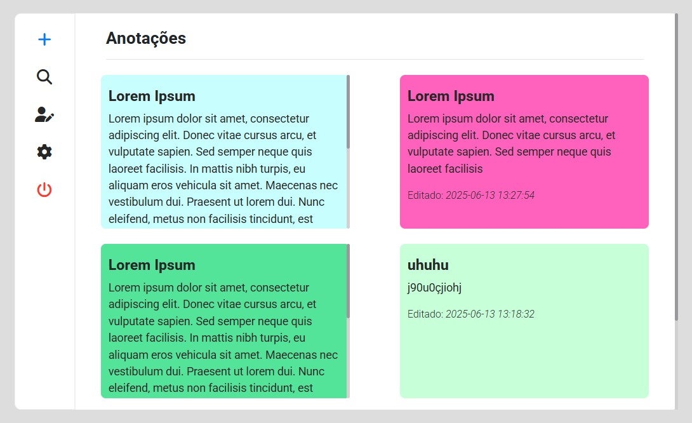

  <h1>Anotações</h1>  

  

 

  <h2>Detalhes:</h2>

  <strong>Status</strong>: Finalizado  
  <strong>Tempo em desenvolvimento</strong>:  3 dias   

  <h2>O que foi utilizado no projeto:</h2>

<ul>
  <li>Figma (prototipagem)</li>
  <li>HTML</li>
  <li>CSS</li>
  <li>Bootstrap 5</li>
  <li>PHP</li>
  <li>Composer</li>
  <li>Mysql</li>
  <li>SQL</li>
  <li>Astah (diagrama de classe)</li>
</ul>

  <h2>O que o sistema faz:</h2>

<ul>
  <li>CRUD usuários</li>
  <li>CRUD anotações</li>
</ul>

  <h2>Melhorias:</h2>

<ul>
  <li>Aprender a criar uma forma de enviar o conteúdo de modo mais amigável (atualmente o input de conteúdo da postagem é um text área que recebe html puro, quero aprender a fazer algo como se fosse um arquivo word...)</li>
  <li>Encapsular melhor as classes e separar responsabilidades</li>
</ul>

  <h2>Aprendizados:</h2>

<ul>
  <li>Usar on uptade current_timestamp() no mysqli</li>
  <li>Preg_match() (usando uma expressão regular para validar string)</li>
  <li>Fazer um sistema com paradigma oo</li>
  <li>Utilizar PDO</li>
</ul>

  <h2>Diagrama de classe</h2>  

  

  <h2>UI</h2>  

  

  

  

  

  

  

